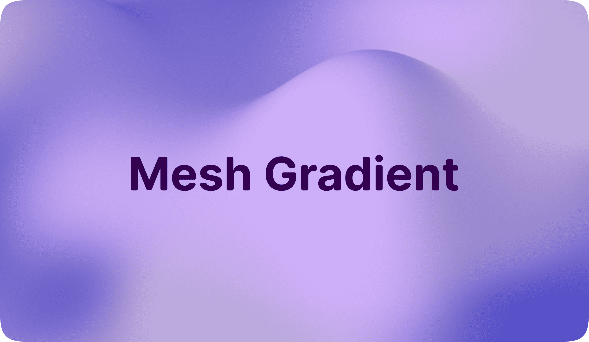

# Mesh Gradient

Apple-inspired animated **mesh gradient** for the web. Written fully on **TypeScript** and supercharged for **all modern frameworks**.

## Documentation

Documetation website [available here.](https://mesh-gradient-docs.vercel.app)

## Packages

- [Vanilla](/packages/core)
- [React](/packages/react)

## Credits

- [@jordienr](https://github.com/jordienr)
- [@kevinhufnagl](https://kevinhufnagl.com/)
- [@stripe](https://stripe.com)

## Contributing

Please read the [contributing guide](/CONTRIBUTING.md).

## License

Licensed under the [MIT license](/LICENSE.md).
