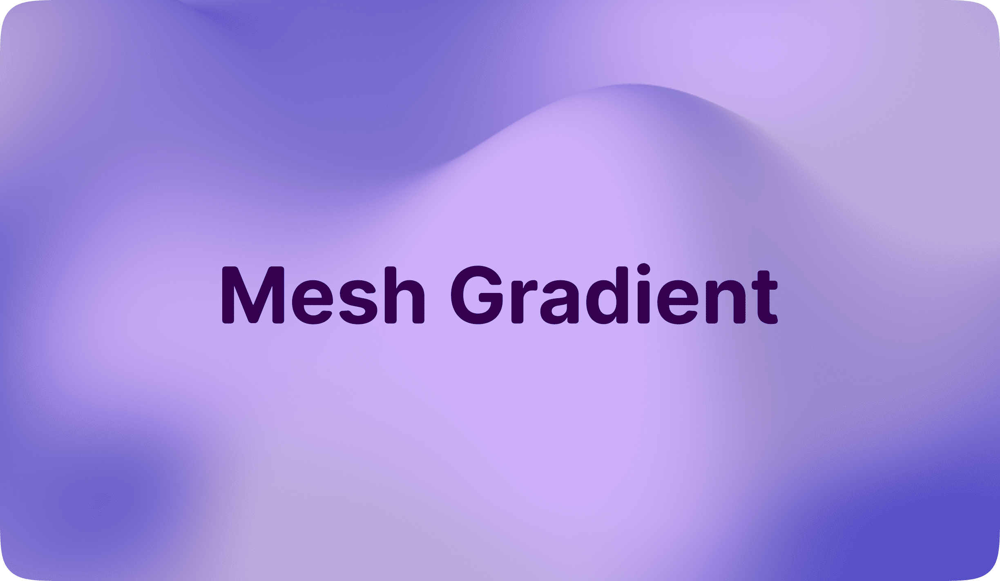

# Mesh Gradient

Apple-inspired animated **mesh gradient** for the web. Written fully on **TypeScript** and packaged for vanilla JS, **React**, and **Vue**.

## Documentation

Documentation site: **[meshgradientweb.vercel.app](https://meshgradientweb.vercel.app)**

**Current npm line: `2.x`.** Major rewrite of the WebGL pipeline, sizing/HiDPI correctness, ResizeObserver-based layout, pacing & accessibility options, richer `MeshGradientOptions`, and refreshed React/Vue integrations. Upgrade **core + react/vue together** — see [**CHANGELOG**](./packages/core/CHANGELOG.md).

## Packages

| Package               | Description                          |
|-----------------------|--------------------------------------|
| [`@mesh-gradient/core`](/packages/core)   | Vanilla `MeshGradient` class (WebGL) |
| [`@mesh-gradient/react`](/packages/react) | React component & hooks               |
| [`@mesh-gradient/vue`](/packages/vue)      | Vue 3 component & composable       |

## Credits

- [@jordienr](https://github.com/jordienr)
- [@kevinhufnagl](https://kevinhufnagl.com/)
- [@stripe](https://stripe.com)

## Contributing

Please read the [contributing guide](/CONTRIBUTING.md).

## License

Licensed under the [MIT license](/LICENSE.md).
